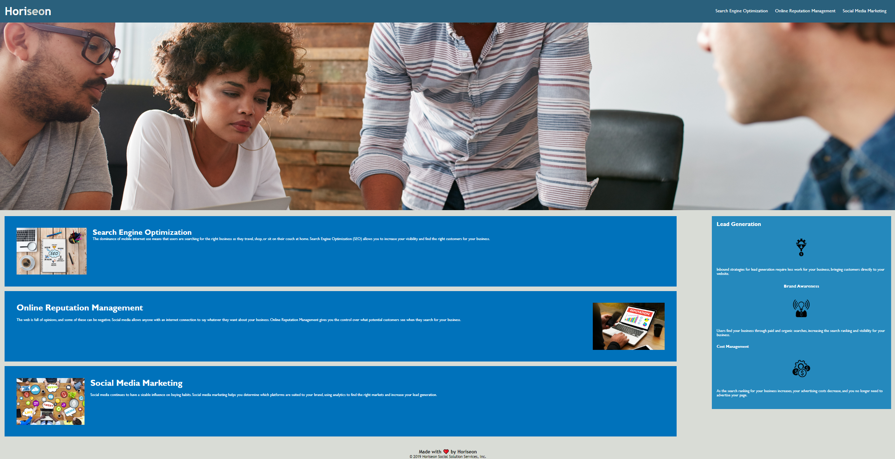

#Homework1-Horiseon

Horiseon code refactoring

Original had a lot of div used, which was changed to semantic elements to make it easier to read
Updated the sematnic elements to reference style.css
Added alt tags for images if the image cannot be displayed

https://eelac.github.io/Homework1-Horiseon/